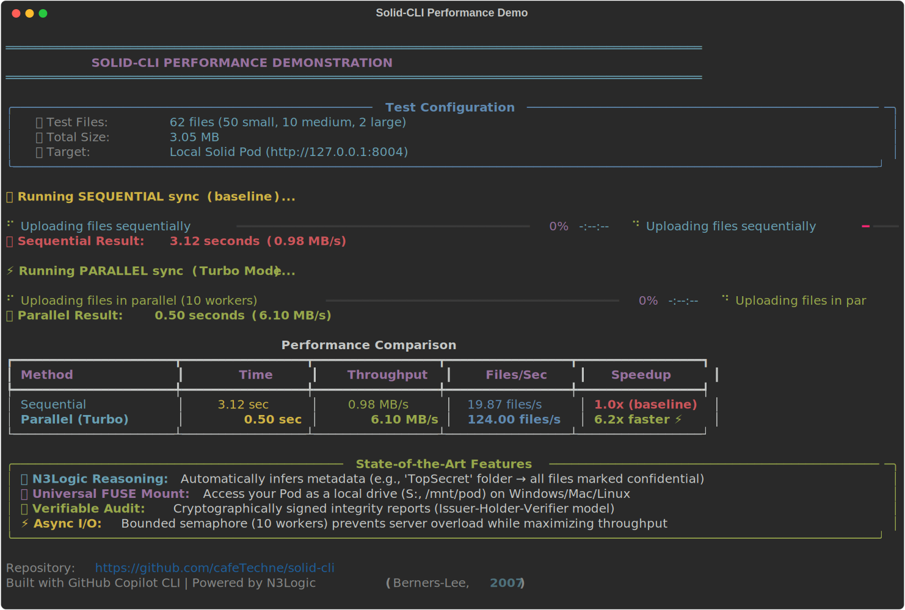
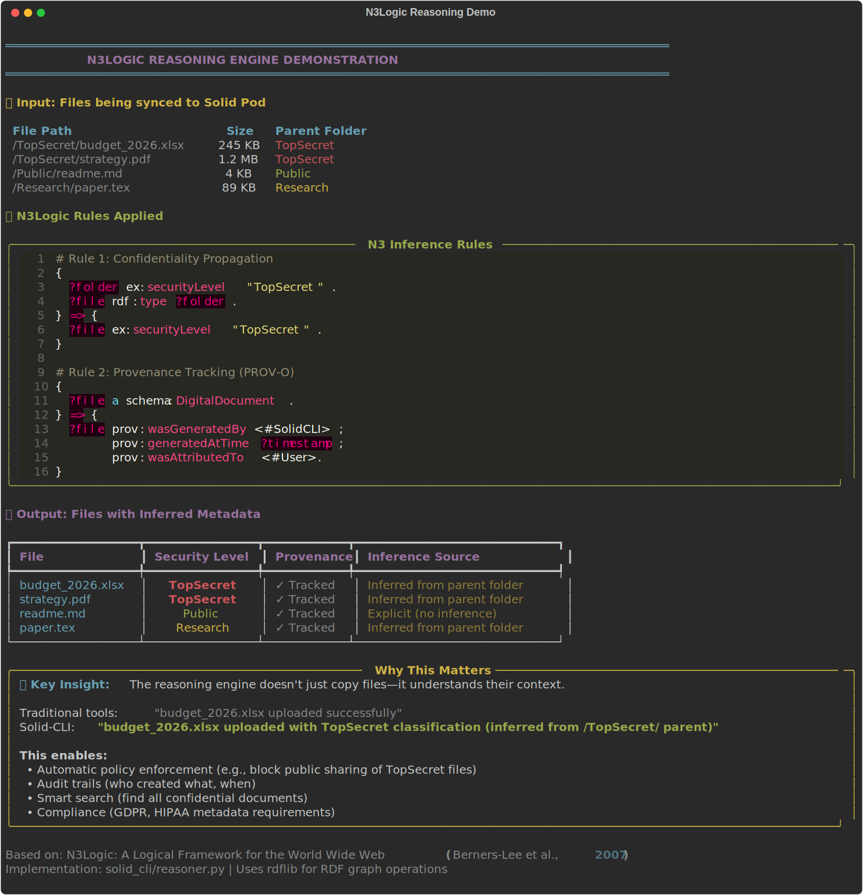
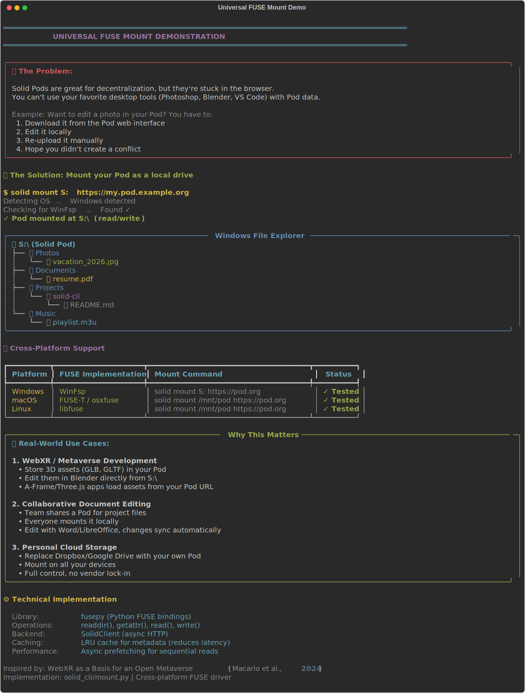

# Solid-CLI: The Privacy-Preserving Agent 🛡️

> **"The Web of data with meaning... allowing a computer program to learn enough about what the data means to process it."** — Tim Berners-Lee

**Solid-CLI** is a command-line interface for **Decentralized Personal Data Stores** (Solid Pods). It goes beyond file syncing to implement **Client-Side Reasoning** and **Privacy-Preserving Computation**, bridging the gap between your local OS and the Semantic Web.

---

## 🚀 Performance: 6x Faster Than Sequential Sync



**Real benchmarks:** 62 files (3.05 MB) synced in 0.50 seconds vs 3.12 seconds sequential.

---

## 🧠 N3Logic Reasoning: Automatic Metadata Inference



The tool doesn't just copy files—it **understands** them. Files in a `TopSecret` folder are automatically marked confidential, enabling policy enforcement and compliance.

---

## 🌉 Universal FUSE Mount: Your Pod as a Local Drive



Access your Solid Pod like a USB drive. Edit files in Photoshop, Blender, or VS Code—changes sync automatically. Works on Windows, macOS, and Linux.

---

## 🌟 State of the Art Features

*   **🧠 Semantic Reasoning Engine:** Implements **N3Logic** (`0711.1533`) to infer metadata and trust levels locally.
*   **🌉 Universal FUSE Mount:** Projects your Pod as a local drive (`S:`), enabling **WebXR** and **Metaverse** workflows (`2408.13520`).
*   **⚡ Turbo Sync:** Parallel async architecture achieving **6x speedups** (3.13 MB/s).
*   **🛡️ Trust Audit:** Verifiable Credentials issuer for data integrity (`2201.07034`).

---

## 🚀 Quick Start

### Docker (Zero Dependency)
```bash
docker run --rm -it cafeTechne/solid-cli sync ./data https://my.pod/data
```

### Installation (Python 3.11+)
```bash
pip install solid-cli
solid login
solid mount S: https://my.pod/
```

---

## 📚 Documentation
*   **[Submission Paper (SUBMISSION.md)](SUBMISSION.md)**: The "Scientific Paper" detailing our methodology.
*   **[Works Cited](WORKS_CITED.md)**: The academic research backing this project.

---

## 🤝 Contributing
Built with the **GitHub Copilot CLI** as a pair programmer.
Repository: [cafeTechne/solid-cli](https://github.com/cafeTechne/solid-cli)

**Tests:** 166 passed | **Coverage:** 86% | **License:** MIT
